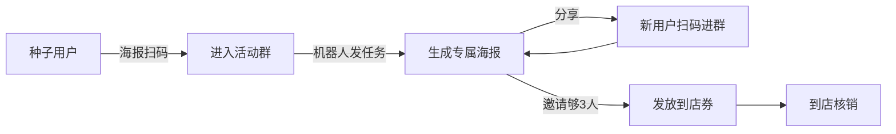

# 好的功能发散输出范例

> 当 AI 输出方案时，请参照此结构和颗粒度。

---

## 用户提问
"我做零售连锁，想做一个群裂变活动，怎么设计？"

## AI 输出范例 ↓

### 1. 我理解的需求
你希望通过"老客户邀请新客户进群"的方式，低成本获取新客并沉淀进社群，从而带动门店复购。
目标客户是已有的会员，期望产出新会员数 + 后续到店消费。

### 2. 行业现状与竞品对标
- **行业通用做法**：海报裂变（邀请 N 人进群解锁福利）、阶梯奖品、限时紧迫感
- **微伴**：模板化裂变工具，配置 5 分钟上线
- **微盛**：裂变 + 自动打标 + 后续 SOP 一体化
- **差异化机会点**：零售场景可结合"门店核销"，让线上裂变带来线下到店

### 3. 推荐方案（3 个）

**方案 A：经典群裂变（推荐）**
- 用户扫码进群 → 自动发任务话术 → 邀请 3 人进群 → 领 30 元到店券
- 优势：链路清晰、成本可控
- 劣势：群质量参差
- 成本：低（2 周开发）

**方案 B：阶梯任务宝**
- 邀请 3 人得 A 礼、5 人得 B 礼、10 人得 C 礼
- 优势：用户粘性高、传播性强
- 劣势：奖品成本高
- 成本：中（3 周）

**方案 C：门店核销裂变**
- 线上裂变券 + 必须到店核销
- 优势：拉通线下，提升真实到店
- 劣势：体验链路长
- 成本：中高（4 周）

### 4. 业务流程图（方案 A）

### 5. 功能清单
| 功能 | 必备度 | 工作量 |
|---|---|---|
| 裂变海报生成器 | ★★★★★ | 3d |
| 邀请关系追踪 | ★★★★★ | 5d |
| 任务完成判定 | ★★★★★ | 2d |
| 奖品发放 | ★★★★★ | 3d |
| 防作弊机制 | ★★★★ | 3d |
| 数据看板 | ★★★★ | 2d |

### 6. 数据指标与埋点
- 北极星：新增有效会员数
- 过程：扫码量、参与率、K 因子、奖品发放率、到店核销率
- 埋点：海报曝光、扫码、任务完成、领奖、核销

### 7. 企微接口依赖
- 群活码：`externalcontact/groupchat/*`
- 自动打标：`externalcontact/mark_tag`
- 群发任务话术：群机器人 / 自建应用消息

### 8. 合规与风险
- ⚠️ 海报文案避免"诱导分享"措辞
- ⚠️ 一个群上限 200 人，需准备多群轮转
- ⚠️ 防羊毛党：手机号 + IP + 设备指纹三重校验

### 9. 下一步行动
- 产品：1 周内出原型 + PRD
- 技术：评估邀请关系追踪方案、确认企微接口
- 运营：准备海报设计、奖品采购、种子用户清单