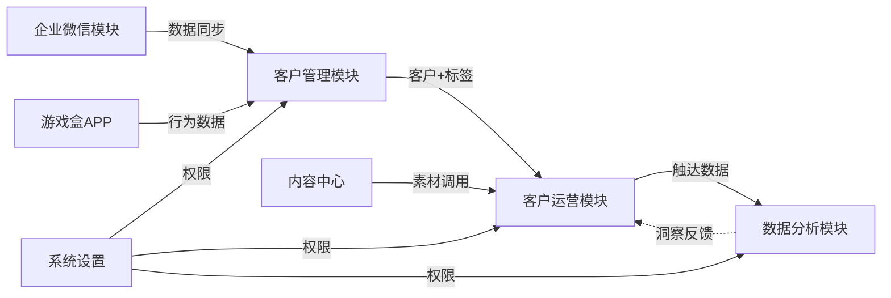

# 产品结构完整图谱

## 一、完整模块树

```
4399游戏盒 SCRM
│
├── 工作台 (Work) /work/
│   ├── 首页概览
│   ├── 待办事项
│   ├── 消息通知
│   └── 快捷入口
│
├── 客户管理 (Customer) /work/customer/
│   ├── 客户列表
│   │   ├── 全部客户
│   │   ├── 我的客户
│   │   ├── 公海客户
│   │   └── 回收站
│   ├── 客户详情（360°视图）
│   │   ├── 基本信息
│   │   ├── 联系记录
│   │   ├── 订单记录
│   │   └── 标签画像
│   ├── 客户分组
│   │   ├── 分组管理
│   │   └── 分组规则
│   ├── 客户标签
│   │   ├── 标签体系
│   │   └── 自动标签
│   └── 客户导入/导出
│
├── 客户运营 (Operation) /work/operation/
│   ├── 群发消息
│   │   ├── 群发朋友圈
│   │   ├── 群发私信
│   │   └── 群发模板
│   ├── 营销活动
│   │   ├── 活动列表
│   │   ├── 活动创建
│   │   └── 活动数据
│   ├── 客户旅程
│   │   ├── 旅程设计
│   │   ├── 触发条件
│   │   └── 自动化流程
│   └── 内容中心
│       ├── 素材库
│       ├── 话术库
│       └── 海报模板
│
├── 数据分析 (Analytics) /work/analytics/
│   ├── 客户数据（增长/分布/价值）
│   ├── 运营数据（触达/转化/互动）
│   ├── 销售数据（业绩/漏斗/订单）
│   └── 数据报表（日周月报 / 自定义）
│
├── 企业微信 (WeCom) /work/wecom/
│   ├── 员工管理（员工/部门/权限）
│   ├── 客户联系（统计/客户群/流失）
│   ├── 消息存档（会话/敏感词/合规审计）
│   └── 应用配置（欢迎语/自动回复/菜单）
│
├── 系统设置 (Settings) /work/settings/
│   ├── 企业设置（信息/品牌/接口）
│   ├── 权限管理（角色/分配/数据权限）
│   ├── 日志管理（操作/登录/系统）
│   └── 其他（通知/集成/备份）
│
└── 个人中心 (Profile) /work/profile/
    ├── 个人信息
    ├── 账号安全
    ├── 消息设置
    └── 帮助中心
```

## 二、模块功能矩阵

| 模块 | 使用频率 | 重要性 | 主要角色 | 核心价值 |
|---|---|---|---|---|
| 客户管理 | 高 | 核心 | 运营/销售 | 客户资产沉淀 |
| 客户运营 | 高 | 核心 | 运营 | 运营动作执行 |
| 企业微信 | 高 | 核心 | 管理/运营 | 企微能力承接 |
| 数据分析 | 中 | 重要 | 管理/运营 | 决策支持 |
| 系统设置 | 低 | 重要 | 管理员 | 平台治理 |

## 三、模块间关系



## 四、关键产品特色

1. **企微 + 游戏盒 APP 双数据源**：行业内独有，能拿到玩家行为数据
2. **客户旅程自动化**：可设计触发条件 + 自动化流程
3. **会话存档合规**：满足游戏行业的运营审计需求
4. **多角色权限体系**：支持 6 种角色 + 数据权限隔离

## 五、给 AI 的提示

- 任何功能方案先想"放在 6 大模块的哪个位置"
- 客户管理是**资产沉淀**层，客户运营是**动作执行**层，不要混淆
- 数据分析模块是消费者，不要把分析逻辑塞到运营模块
- 内容中心是被复用的，群发 / 旅程 / 活动都从这里取素材