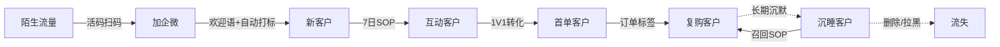

# 客户生命周期流程

```mermaid
flowchart LR
    A[陌生流量] -->|活码扫码| B[加企微]
    B -->|欢迎语+自动打标| C[新客户]
    C -->|7日SOP| D[互动客户]
    D -->|1V1转化| E[首单客户]
    E -->|订单标签| F[复购客户]
    F -.->|长期沉默| G[沉睡客户]
    G -->|召回SOP| F
    G -.->|删除/拉黑| H[流失]
```

## 节点说明
- 新客户 → 互动客户：标签条件「7 日内有 1 次互动」
- 互动客户 → 首单：触发优惠券推送
- 首单 → 复购：T+30 / T+60 触达
- 复购 → 沉睡：60 天未互动