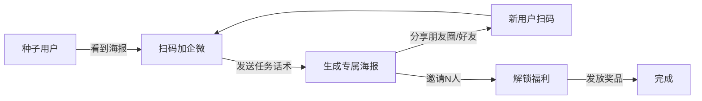

# 群裂变流程

```mermaid
flowchart LR
    A[种子用户] -->|看到海报| B[扫码加企微]
    B -->|发送任务话术| C[生成专属海报]
    C -->|分享朋友圈/好友| D[新用户扫码]
    D --> B
    C -->|邀请N人| E[解锁福利]
    E -->|发放奖品| F[完成]
```

## 关键控制
- 防作弊：同 IP / 同设备识别
- 邀请关系：external_userid 追溯
- 奖品发放：自动 / 人工审核