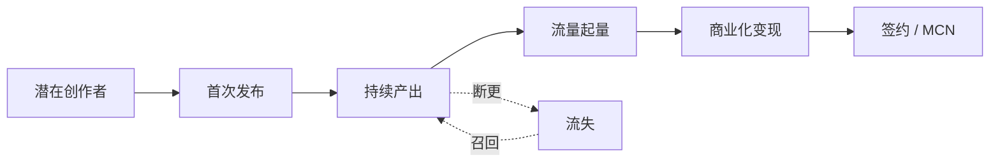

# 创作者运营

## 一、创作者分层与对应运营策略

| 层级 | 标准 | 私域角色 | 运营重点 |
|---|---|---|---|
| 萌新（L1） | 新注册创作者 | 进萌新创作者群 | 入门指引、第一篇曝光 |
| 成长（L2） | 月发 4 篇 + 总播放 1w | 进成长群 | 流量扶持、内容方向引导 |
| 腰部（L3） | 月发 8 篇 + 月播放 10w | 1V1 经纪人 | 商业化对接、独家选题 |
| 头部（L4） | 月播放 100w+ | 1V1 高级经纪人 | 签约、独家合作、年度战略 |
| MCN（B 端） | 多账号矩阵 | B 端商务对接 | 内容合作框架协议 |

## 二、创作者全生命周期

## 三、激励体系

### 1. 流量激励
- 新人首发流量包（前 3 篇必给曝光）
- 算法加权
- 编辑推荐位

### 2. 现金激励
- 创作激励金（按播放阶梯）
- 任务奖励（命题创作 / 热点跟进）
- 比赛奖金

### 3. 商业化激励
- 平台撮合广告订单（CPS / CPM）
- 直播打赏分成
- 内容付费分成

### 4. 荣誉激励
- 创作者等级体系
- 月榜 / 年榜
- 年度盛典邀请

## 四、签约体系

| 类型 | 内容 | 适合 |
|---|---|---|
| 流量扶持协议 | 月更承诺换流量包 | 腰部 |
| 独家协议 | 内容首发 / 独家平台 | 头部 |
| 全约 | 全权代理 + 商务 | 顶部 KOL |
| MCN 协议 | 与 MCN 公司合作 | 矩阵账号 |

## 五、私域中的创作者运营 SOP

### 萌新创作者 7 日 SOP
| 时间 | 动作 | 内容 |
|---|---|---|
| T+0 | 进群 + 私信 | 创作者欢迎 + 入门指南 + 首发流量包说明 |
| T+1 | 私信 | 选题灵感包（按品类） |
| T+3 | 群内 @ | 鼓励首发 + 同期萌新展示 |
| T+7 | 数据反馈 | 你的首篇数据 / 改进建议 |
| T+14 | 评估 | 月发 ≥2 → 进 L2 群；否则继续陪跑 |

### 腰部创作者运营
- 周报：数据 / 平台资源
- 月会：选题会、行业趋势
- 1V1 经纪人对接

### 头部 KOL 服务
- 独家素材 / 内幕信息
- 商业化订单优先匹配
- 年度战略沟通

## 六、创作者获客（让更多人来创作）

### 1. 老玩家转化
- 高互动玩家 → 引导成为创作者
- "你的评论很有见地，要不要试试发个攻略"

### 2. 跨平台招募
- B 站 / 抖音游戏区创作者私信邀请
- 给予迁移激励

### 3. 高校 / 社团合作
- 电竞协会 / 游戏社团对接

### 4. 创作者比赛
- 每月主题赛
- 大奖 + 流量曝光

## 七、关键指标

| 指标 | 健康值 |
|---|---|
| 月新增创作者 | 持续增长 |
| 创作者活跃率（月发≥1） | >40% |
| 腰部以上创作者数 | 平台核心资产 |
| 创作者月均收益 | 反映平台吸引力 |
| 签约率 | 头部锁定能力 |

## 八、给 AI 的提示
- 创作者运营是平台核心，远比"卖货"重要
- 萌新创作者的"首发体验"决定他是否留下来
- 头部 KOL 必须有专人 1V1 服务
- 商业化对接是签约的关键诱因