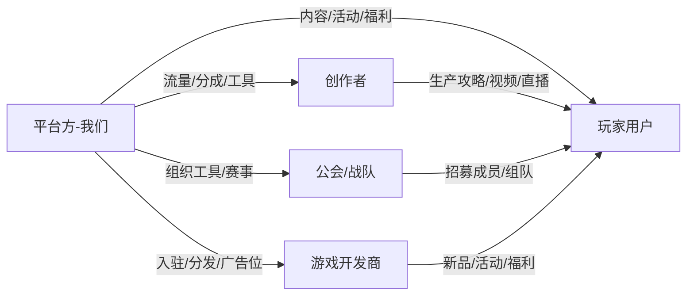

# 游戏社区平台 - 业务全景

## 一句话定位
连接玩家、内容创作者、公会、游戏开发者的多边社区平台，
私域 SCRM 的核心使命是「**沉淀高价值用户 + 激活创作生态 + 驱动商业化**」。

## 类比标杆（让 AI 快速理解我们是什么样的产品）
- 玩家社区维度：TapTap、好游快爆、小黑盒
- 内容生态维度：B 站游戏区、抖音游戏区、小红书游戏话题
- 工具+社交维度：Discord、巴哈姆特、NGA
- 公会/电竞维度：掌上 LOL、企鹅电竞

## 多边角色生态



## 私域 SCRM 在我们业务中的角色

不是简单的"加好友卖东西"，而是 **多角色用户资产的运营底座**：

| 角色 | 私域价值 | 主要触达场景 |
|---|---|---|
| 普通玩家 | 内容消费 + 商城下单 + 活动参与 | 群、朋友圈、1V1 福利发放 |
| 核心玩家 | 社区氛围、UGC 来源、口碑传播 | 核心玩家群、专属活动 |
| 创作者 | 内容供给、流量贡献、商业化分成 | 创作者群、签约顾问 1V1 |
| 公会会长 | 组织流量、活动承接 | 公会群、运营对接群 |
| 游戏开发商 | B 端商业化 | 商务对接群、企微顾问 |

## 核心业务链路

```
1. 玩家路径（C 端）：
   外部流量 → 加企微/进群 → 内容兴趣激活 → 平台留存 → UGC贡献 → 商业化转化

2. 创作者路径（C+B 端）：
   普通用户 → 内容创作 → 流量扶持 → 签约 → 商业化分成 → 头部 KOL

3. 公会路径：
   公会会长入驻 → 组织工具赋能 → 公会活跃 → 平台流量回报

4. 开发者路径（B 端）：
   开发商入驻 → 内容曝光 → 私域用户测试 → 广告投放 → CPS 分成
```

## 北极星指标候选
- 私域用户 DAU 占平台总 DAU 的比例
- 私域用户 30 日留存率
- 私域驱动的 UGC 内容量
- 私域用户 ARPU（广告 + 电商 + 付费）

## 给 AI 的方案设计提示
- 任何方案先问"针对哪类角色"
- 不要把所有用户当成"玩家"一刀切
- 内容生态是飞轮，不是单点功能
- 商业化要分清：C 端付费 vs B 端广告 vs CPS 分成